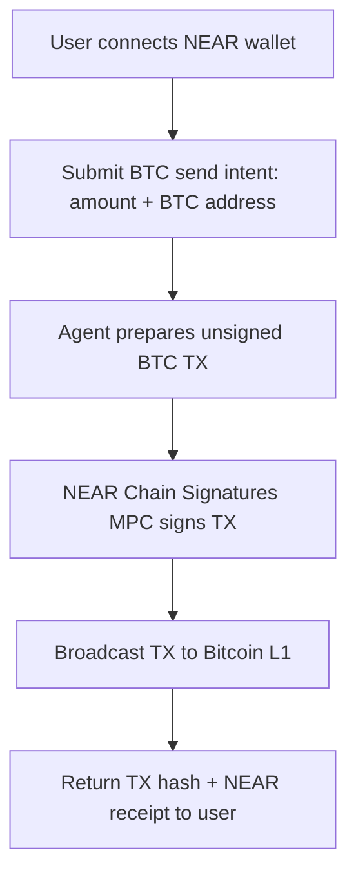
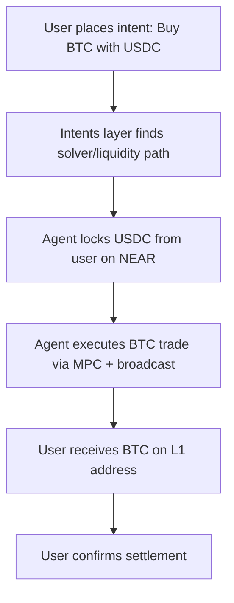
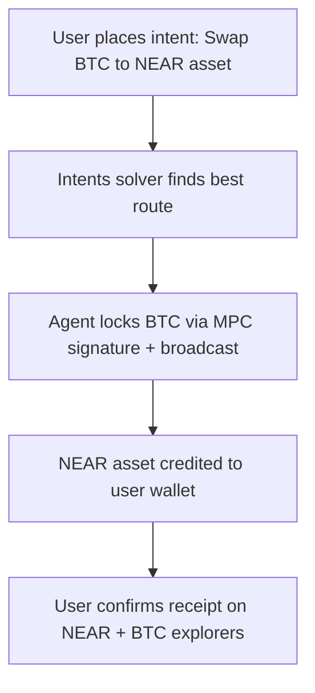
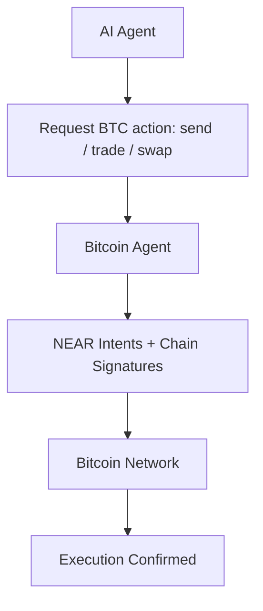

# Bitcoin Agent — User Personas & Flow Diagrams

**Scope:** NEAR Protocol MVP. Native BTC transactions via NEAR accounts using **Chain Signatures** and **Intents**. Support for send, buy/sell, and swap BTC → NEAR assets. Agent execution integrated with NEAR AI and Bitte.ai .

---

## 1) Purpose & Scope

This document provides (a) concise user personas and (b) system/user flow diagrams for **Bitcoin Agent’s MVP**.

- Transactions: **native BTC L1** initiated from NEAR accounts.
- Trading: **buy, sell, and swap BTC** via NEAR Intents (trust-minimized, no bridges).
- AI: Agent is deployed on **Bitte.ai infra** so other AI agents can query and invoke it.

---

## 2) Personas

### A) NEAR Account Holder (BTC Sender)

**Profile:** NEAR ecosystem user with NEAR Accounts. Comfortable with wallets but not with bridging/wrapped tokens.  
**Goals:**

- Send real BTC from a NEAR account.
- Avoid custody/bridges.
- Benefit from composability with other NEAR dApps.

**Key actions**

- Connect NEAR wallet.
- Request “send BTC to X address through agent.”
- Agent signs transaction via MPC and broadcasts to Bitcoin L1.
- Track status on NEAR + Bitcoin explorers.

**Decision cues**

- Needs confirmation time + fee estimate.
- Prefers minimal friction (no external bridging UI).

**Risks / concerns**

- Long Bitcoin confirmation times.
- Trust in agent execution.

**Metrics**

- TX success rate.
- Average BTC confirmation latency.

---

### B) Trader / DeFi User (Buy/Sell BTC)

**Profile:** User familiar with DEXs and NEAR Intents, seeking BTC exposure.  
**Goals:**

- Buy/sell BTC directly from NEAR.
- Trust-minimized execution.
- Composability with NEAR DeFi (e.g. USDC, NEAR, etc.).

**Key actions**

- Place intent: “Buy 0.01 BTC using USDC.”
- Agent routes to liquidity sources (intent solver).
- BTC settlement executed via Chain Signatures.
- Receive BTC confirmation + NEAR transaction proof.

**Decision cues**

- Compares slippage, execution cost, settlement speed.

**Risks / concerns**

- Partial fills.
- BTC mempool congestion.

**Metrics**

- Trade fill rate.
- Slippage vs quoted price.

---

### C) Swapper (BTC → NEAR Assets)

**Profile:** NEAR DeFi user holding BTC but wants to swap into ecosystem-native tokens.  
**Goals:**

- Swap BTC directly into NEAR assets (e.g. NEAR, USDT, USDC).
- Avoid bridging friction.
- Leverage intents for best swap execution.

**Key actions**

- Submit swap intent: “Swap 0.005 BTC → 100 USDC.”
- Agent routes swap through NEAR Intents solver.
- BTC signed and broadcast on L1, assets credited on NEAR.

**Decision cues**

- Wants best execution path.
- Needs transparency on BTC fee + slippage.

**Risks / concerns**

- Liquidity shortages.
- Swap stuck due to BTC confirmation delays.

**Metrics**

- Swap completion time.
- % swaps completed successfully.

---

### D) AI Agent Developer (Agent Integrator)

**Profile:** Developer building autonomous agents/dApps on NEAR AI.  
**Goals:**

- Integrate Bitcoin Agent to handle BTC transfers, trades, and swaps.
- Offload complexity of cross-chain signing & broadcasting.
- Access BTC liquidity for higher-level AI apps (e.g. trading bots, arbitrage).

**Key actions**

- Call Bitcoin Agent endpoint with JSON (`/api/ai-plugin`).
- Get execution receipt & status.
- Chain follow-up logic (hedging, settlements).

**Decision cues**

- Wants clean API surface.
- Needs predictable error handling.

**Risks / concerns**

- Agent downtime.
- Gas/fee unpredictability.

**Metrics**

- Successful AI invocations.
- End-to-end latency.

---

## 3) User Needs

- **As a NEAR user**, I want to send BTC directly from my account without wrapping so I stay in custody and fully onchain.
- **As a trader**, I want to buy/sell/swap BTC with NEAR assets using intents so I get best execution without bridges.
- **As a developer**, I want to call Bitcoin Agent from NEAR AI infra so my agent can use BTC in its workflows.

---

## 4) Entities & Contracts

- **Bitcoin Agent Manifest:** Orchestrates intents, signs with MPC (Chain Signatures), exposes `/api/ai-plugin`.
- **NEAR Intents Layer:** Solver network executing buy/sell/swap orders.
- **MPC Signers (NEAR Chain Signatures):** Secure multi-party signature generation for Bitcoin L1.
- **BTC Network (L1):** Settlement layer for BTC transfers.

---

## 5) Flow Diagrams

### A) BTC Send (NEAR Account Holder)

### B) Buy/Sell BTC via Intents

### C) Swap BTC → NEAR Assets

### D) AI Agent Invocation

## 6) States & UX Model

**Idle**: Agent inactive.

**Intent Pending**: User submitted (send/trade/swap).

**MPC Signing**: Transaction under signature ceremony.

**Broadcasted**: TX sent to Bitcoin mempool.

**Confirmed**: Finalized on Bitcoin.

**Failed**: Error in signing, liquidity, or mempool rejection.

## 7) Edge Cases

**BTC mempool backlog**: Delay settlement UI, retry broadcast.

**Insufficient NEAR gas/fee balance**: Reject request upfront.

**Liquidity shortage (trades/swaps)**: Partial fill or reject.

**AI integration failures**: Return structured error JSON.

## 6) States & UX Model

**Idle**: Agent inactive.

**Intent Pending**: User submitted (send/trade/swap).

**MPC Signing**: Transaction under signature ceremony.

**Broadcasted**: TX sent to Bitcoin mempool.

**Confirmed**: Finalized on Bitcoin.

**Failed**: Error in signing, liquidity, or mempool rejection.

## 7) Edge Cases

**BTC mempool backlog**: Delay settlement UI, retry broadcast.

**Insufficient NEAR gas/fee balance**: Reject request upfront.

**Liquidity shortage (trades/swaps)**: Partial fill or reject.

**AI integration failures**: Return structured error JSON.

## 8) KPIs

**User (BTC Sender)**: Median time send → confirmed.

**Trader**: Slippage vs intent; % trades filled.

**Swapper**: Swap success rate; settlement latency.

**AI Developer**: Successful API calls vs errors.

**System**: MPC uptime; mempool broadcast success rate.

## 9) Deliverables Checklist

✅ Personas (User, Trader, Swapper, AI Developer).

✅ Flows (BTC send, buy/sell, swap, AI integration).

✅ State model & edge cases.

✅ KPIs mapped to each persona.
