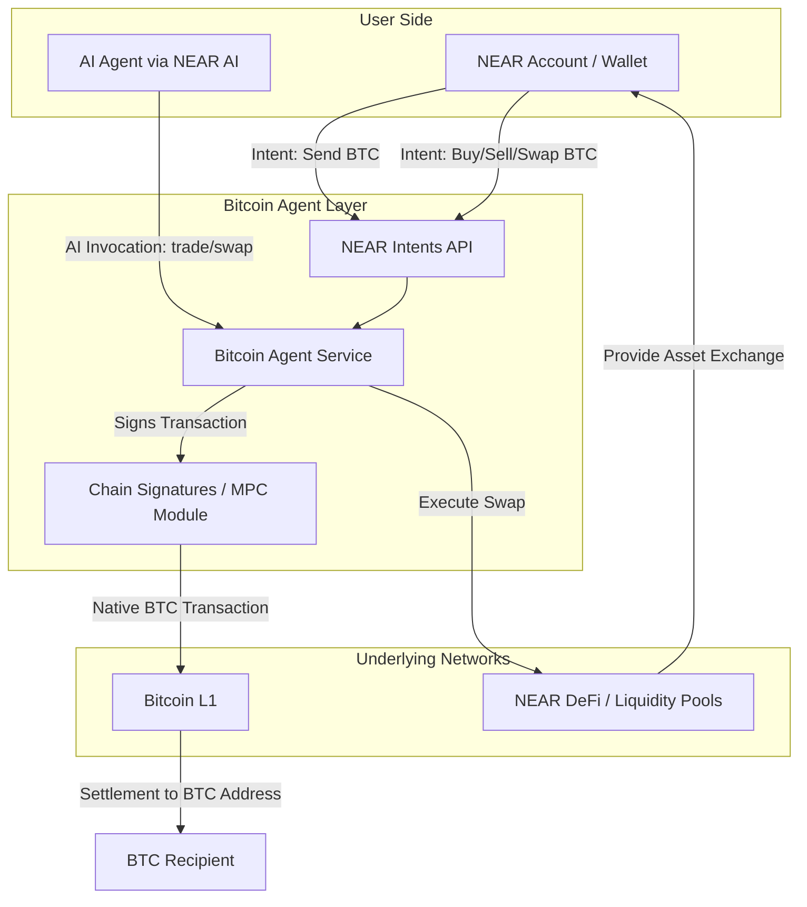
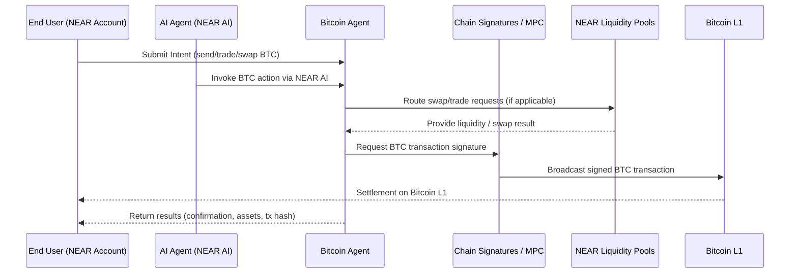

# Value Flow Diagram : Bitcoin Agent

## Overview

This document illustrates how **value and actions flow** between users, liquidity providers, Bitcoin Agent, NEAR AI, and the underlying networks (**NEAR** and **Bitcoin L1**).  
It includes both a **high-level flowchart** and a **swimlane diagram** for clarity.

---

## Actors

- **End User (NEAR Account Holder):** Wants to send, trade, or swap real BTC without leaving NEAR.
- **Liquidity Provider (NEAR DeFi):** Provides assets on NEAR for BTC swaps via intents.
- **Bitcoin Agent (Execution Layer):** Middleware that signs BTC transactions with NEAR chain signatures and executes swaps via intents.
- **AI Agents (NEAR AI):** Invoke Bitcoin Agent to automate BTC actions.
- **Bitcoin L1 Network:** Settlement layer for BTC transactions.

---

## Flow Diagram (High-Level)

### High-Level Value Flow (System Overview)

---

### Detailed Transaction Flow (Sequence Diagram)

---
